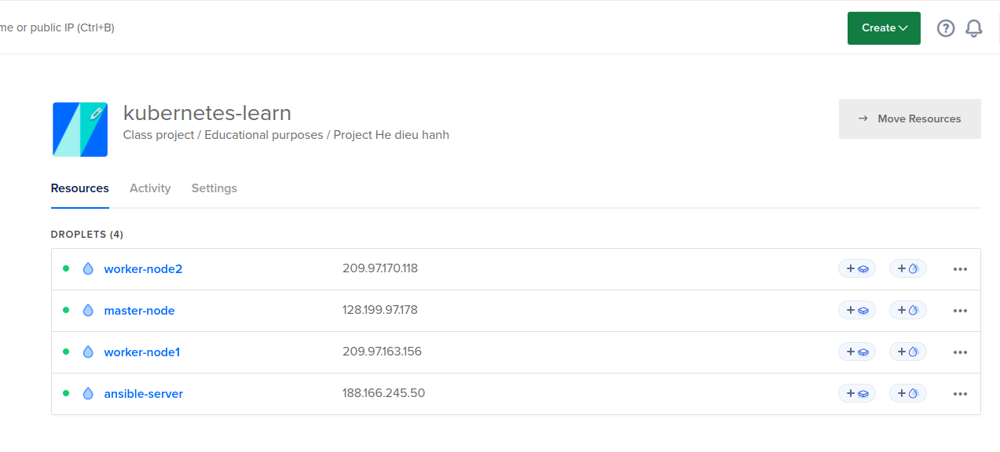
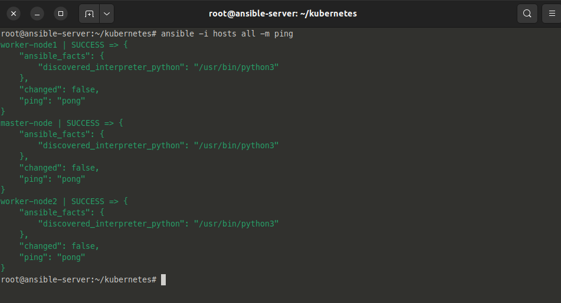
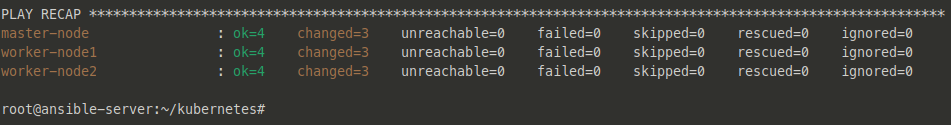
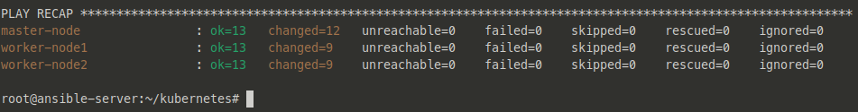
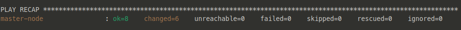
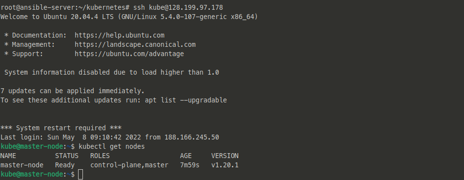
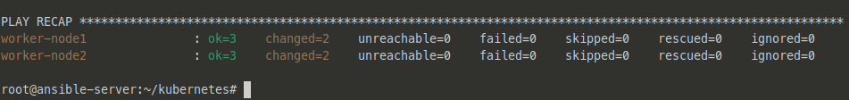
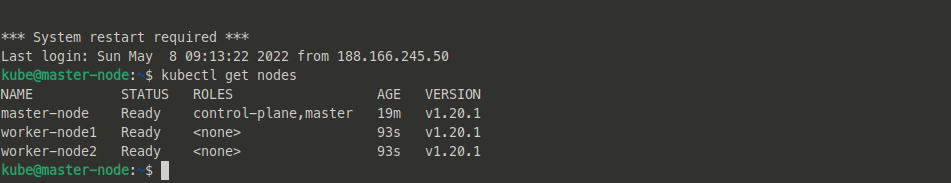

# kubernetes-learn  

_something about Kubernetes_  
 

## I. Tổng quan

 

### Kubernetes là gì?

### Kubernetes giải quyết vấn đề gì?

### Kubernetes dùng trong tình huống nào?

 

## II. Một số khái niệm cơ bản

### 1. Master Node

### 2. Worker Node

### 3. kubectl

### 4. Pod

### 5. Image

### 6. Deployment

### 7. Replicas Controller

### 8. Service

### 9. Label

## III. Triển khai

### **Thử nghiệm triển khai Kubernetes Cluster Multinode bằng Ansible**  

- Trong bài tiểu luận này, chúng tôi sẽ sử dụng Ansible để triển một Kubernetes cluster nhỏ - với 1 master node quản lý 2 worker node.  

- Để thự hiện triển khai, chúng tôi thực hiện sử dụng các thao tác sau dựa trên Ansible:

1. Tạo một User mới để sử dụng kubernetes trên mỗi node

2. Cài đặt kubernetes và containerd trên mỗi node

3. Cấu hình cho Master node

4. Thêm các worker node vào cluster  

### Chuẩn bị  

- 1 server đã được cài đặt Ansible dùng để quản lý và tự động hóa cho toàn bộ hệ thống.

- 3 server được sử dụng để triển khai kubernetes cluster.

_Chúng tôi sử dụng dịch vụ Digital Ocean nhằm tạo các máy ảo phục vụ cho việc triển khai hệ thống. Thông tin chi tiết về Digital Ocean, xem tại: <https://www.digitalocean.com/about>_

### Mô hình triển khai

- Cấu hình chung

        Ubuntu 20.04 (LTS) x64
        1vCPU / 2GB RAM / 50GB Disk

- `ansible-server`  

        IP: 188.166.245.50

- `master-node`  

        IP: 128.199.97.178

- `worker-node1`  

        IP: 209.97.163.156

- `worker-node2`  

        IP: 209.97.170.118

    

- Với mặc định rằng ansbile-server đã được cài đặt Ansible và kết nối SSH tới các server trong hệ thống. Nếu chưa từng cài đặt Ansible, tham khảo tại <https://www.digitalocean.com/community/tutorials/how-to-install-and-configure-ansible-on-ubuntu-20-04>  

### Thiết lập kết nối tới các node trong hệ thống từ ansible-server

#### Tạo thư mục nơi làm việc với các kubernetes node

    mkdir kubernetes
    cd kubernetes

#### Lưu trữ thông tin của các node vào hosts

    nano hosts

#### Nội dung

    [master]
    master-node ansible_host=128.199.97.178 asible_user=root
    [worker]
    worker-node1 ansible_host=209.97.163.156 ansible_user=root
    worker-node2 ansible_host=209.97.170.118 ansible_user=root

#### Kiểm tra kết nối tới các node

- Chạy lệnh:

        ansible -i hosts all -m ping

    

## Cài đặt

### Step 1: Tạo người dùng kubernetes với Ansible Playbook

- Step đầu tiên khi thiết lập kubernetes cluster là tạo một user trên mỗi node, các user đều không phải root, nhưng có đặc quyền sudo.

- Tạo file `users.yml` trong thư mục đang làm việc

        nano users.yml

- Sau đó thêm vào playbook:  

        - hosts: 'master, worker'
          become: yes

          tasks:
            - name: Make sure we have a 'wheel' group
              group:
                name: wheel
                state: present

            - name: allow 'kube' to use sudo without needing a password
              lineinfile:
                dest: /etc/sudoers
                state: present
                regexp: '^%wheel'
                line: '%wheel ALL=(ALL) NOPASSWD: ALL'
                validate: 'visudo -cf %s'
     
            - name: create the kube user account
              user: 
                name=kube
                group=wheel 
                append=yes 
                state=present 
                createhome=yes 
                shell=/bin/bash

            - name: set up authorized keys for the kube user
              authorized_key: user=kube key="{{item}}"
              with_file:
                - ~/.ssh/id_rsa.pub 

- Chạy playbook đầu tiên:  

        ansible-playbook -i hosts users.yml

- Kết quả sau khi chạy:

    

### Step 2: Cài đặt Kubernetes với Ansible Playbook

- Tạo file `install-k8s.yml` và thêm nội dung như sau:
  
        ---
        - hosts: "master, worker"
        remote_user: kube
        become: yes
        become_method: sudo
        become_user: root
        gather_facts: yes
        connection: ssh

        tasks:
            - name: Create containerd config file
            file:
                path: "/etc/modules-load.d/containerd.conf"
                state: "touch"

            - name: Add conf for containerd
            blockinfile:
                path: "/etc/modules-load.d/containerd.conf"
                block: |
                    overlay
                    br_netfilter

            - name: modprobe
            shell: |
                    sudo modprobe overlay
                    sudo modprobe br_netfilter

            - name: Set system configurations for Kubernetes networking
            file:
                path: "/etc/sysctl.d/99-kubernetes-cri.conf"
                state: "touch"

            - name: Add conf for containerd
            blockinfile:
                path: "/etc/sysctl.d/99-kubernetes-cri.conf"
                block: |
                        net.bridge.bridge-nf-call-iptables = 1
                        net.ipv4.ip_forward = 1
                        net.bridge.bridge-nf-call-ip6tables = 1

            - name: Apply new settings
            command: sudo sysctl --system

            - name: install containerd
            shell: |
                    sudo apt-get update && sudo apt-get install -y containerd
                    sudo mkdir -p /etc/containerd
                    sudo containerd config default | sudo tee /etc/containerd/config.toml
                    sudo systemctl restart containerd

            - name: disable swap
            shell: |
                    sudo swapoff -a
                    sudo sed -i '/ swap / s/^\(.*\)$/#\1/g' /etc/fstab

            - name: install and configure dependencies
            shell: |
                    sudo apt-get update && sudo apt-get install -y apt-transport-https curl
                    curl -s https://packages.cloud.google.com/apt/doc/apt-key.gpg | sudo apt-key add -

            - name: Create kubernetes repo file
            file:
                path: "/etc/apt/sources.list.d/kubernetes.list"
                state: "touch"

            - name: Add K8s Source
            blockinfile:
                path: "/etc/apt/sources.list.d/kubernetes.list"
                block: |
                    deb https://apt.kubernetes.io/ kubernetes-xenial main

            - name: install kubernetes
            shell: |
                    sudo apt-get update
                    sudo apt-get install -y kubelet=1.24.1-00 kubeadm=1.24.1-00 kubectl=1.24.1-00
                    sudo apt-mark hold kubelet kubeadm kubectl 

- Playbook `install-k8s.yml` sẽ chạy trên cả 3 node và cài đặt `containerd runtime`, `kubelet`, `kubeadm` và `kubectl`.

- Chạy playbook:
  
        ansible-playbook -i hosts install-k8s.yml

- Kết quả:

    

## Step 3: Tạo Kubernetes Cluster Master node bằng Ansible Playbook

- Tạo file `master.yml`, khởi tạo cluster k8s trên master-node và thiết lập pod-network, sử dụng Calico:
  
        - hosts: master
        become: yes
        tasks:
            - name: initialize the cluster
            shell: kubeadm init --pod-network-cidr=10.244.0.0/16 --ignore-preflight-errors=all 
            args:
                chdir: $HOME
                creates: cluster_initialized.txt

            - name: create .kube directory
              become: yes
              become_user: kube
              file:
                path: $HOME/.kube
                state: directory
                mode: 0755

            - name: copies admin.conf to user's kube config
              copy:
                src: /etc/kubernetes/admin.conf
                dest: /home/kube/.kube/config
                remote_src: yes
                owner: kube

            - name: install Pod network
              become: yes
              become_user: kube
              shell: kubectl apply -f https://docs.projectcalico.org/manifests/calico.yaml 
              args:
                chdir: $HOME
                
            - name: Get the token for joining the worker nodes
              become: yes
              become_user: kube
              shell: kubeadm token create  --print-join-command
              register: kubernetes_join_command

            - debug:
                msg: "{{ kubernetes_join_command.stdout }}"

            - name: Copy join command to local file.
              become: yes
              local_action: copy content="{{ kubernetes_join_command.stdout_lines[0] }}" dest="/tmp/kubernetes_join_command" mode=0777

- Chạy Playbook:

        ansible-playbook -i hosts master,yml

- Kết quả:

    

- Thực hiện SSH vào master-node để kiểm tra với lệnh `kubectl get nodes`

    

## Step 4: Thêm các worker-node vào k8s cluster bằng Ansible Playbook

- Tạo playbook `join-worker.yml`:

        - hosts: worker
          become: yes
          gather_facts: yes

          tasks:
           - name: Copy join command from Ansiblehost to the worker nodes.
             become: yes
             copy:
               src: /tmp/kubernetes_join_command
               dest: /tmp/kubernetes_join_command
               mode: 0777

           - name: Join the Worker nodes to the cluster.
             become: yes
             command: sh /tmp/kubernetes_join_command
             register: joined_or_not

- Chạy playbook:

        ansible-playbook -i hosts join-worker.yml

- Kết quả:

    

- Sau khi hoàn thành, thực hiện SSH vào master-node và kiểm tra lại các node

    

 

## IV. Kết quả- Nhận xét

- Qua việc thực hành triển khai Kubernetes Cluster multinode dựa trên công cụ Ansible, ta có thể thấy việc triển khai các cụm k8s đã trở lên dễ dàng hơn rất nhiều so với các biện pháp thử công.

- Với Ansible, việc khởi tạo một Cluster K8s với hàng trăm, hàng nghìn nodes có thể thực hiện một cách đơn giản chỉ với vài dòng lệnh, điều này sẽ tiết kiệm rất nhiều thời gian và công sức cho các nhà phát triển, vận hành ứng dụng, tối đa hóa tài nguyên, chí phí.

## V. References

- [1]. <https://buildvirtual.net/deploy-a-kubernetes-cluster-using-ansible/>

- [2]. <https://github.com/buildvirtual-git/kubernetes/tree/main/ansible-deploy-k8s>

- [3]. <https://www.digitalocean.com/community/tutorials/how-to-install-and-configure-ansible-on-ubuntu-20-04>  
